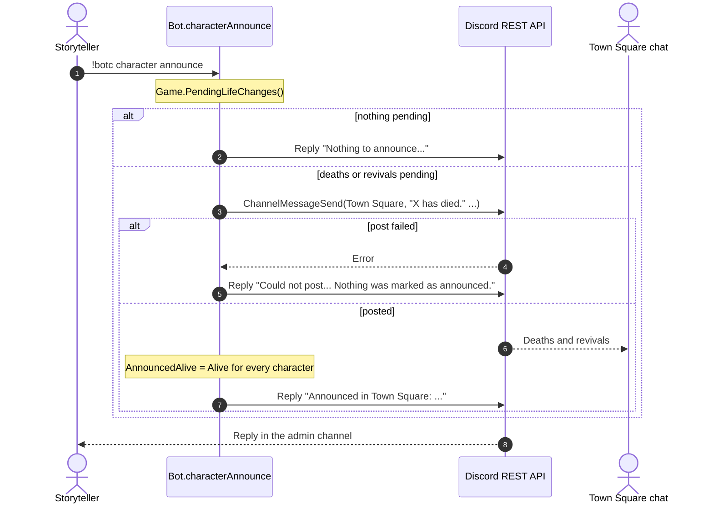
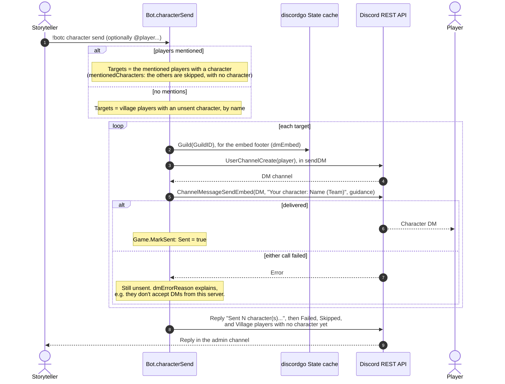
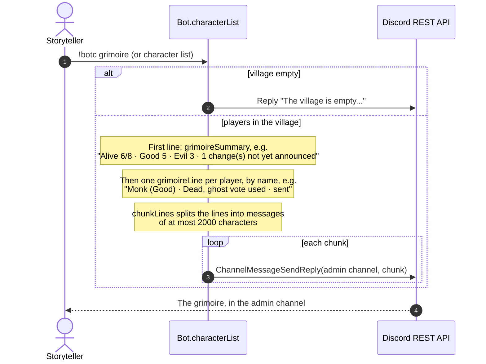
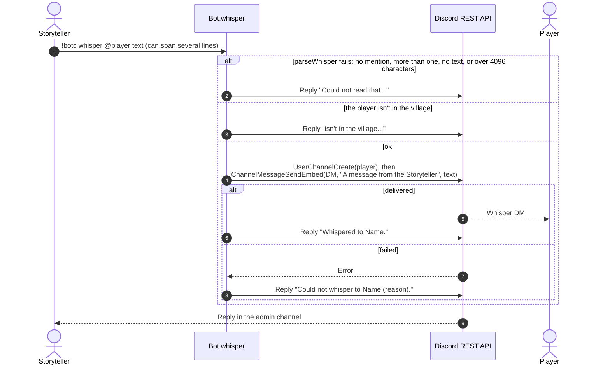

# Characters, deaths and whispers

[← UML index](README.md)

The Storyteller gives each village player a secret character and team, sends them by DM, and tracks deaths and ghost votes. Covers [internal/bot/characters.go](../../internal/bot/characters.go), [internal/bot/grimoire.go](../../internal/bot/grimoire.go), [internal/bot/whisper.go](../../internal/bot/whisper.go) and [internal/bot/parse.go](../../internal/bot/parse.go). Spec: [characters.md](../specs/characters.md).

Like every command, `character`, `grimoire` and `whisper` only run for the Storyteller in the admin channel; [`allowed`](command-dispatch.md#activity-allowed) checks that before they're called. A character (`Game.Characters`, user ID → `*Character`) holds these fields:

| Field | Meaning |
| --- | --- |
| `Name`, `Guidance`, `Team` | What the player is told. `Team` is Good or Evil. |
| `Sent` | Whether the player has been sent the current version. `assign` and `team` set it to false, and `send` sets it to true. |
| `Alive` | Changed by `kill` and `revive`. Not public until `announce`. |
| `AnnouncedAlive` | `Alive` as of the last `announce`. Where it differs from `Alive`, a change is waiting to be announced. |
| `GhostVoteUsed` | Whether a dead player has used their ghost vote. `revive` resets it. |

## Activity: `character assign`

`assign` parses the raw message text rather than splitting it into words, so multi-line guidance and Markdown survive exactly as typed.

```mermaid
flowchart TD
    start((" ")):::initial --> mention("splitAtMention: normalise line endings,<br/>find the mention on the first line")
    mention --> d1{" "}
    d1 -->|"[no mention, or more than one]"| bad("Reply: Could not read that, with the usage")
    d1 -->|"[exactly one mention]"| d2{" "}
    d2 -->|"[nothing after the mention]"| bad
    d2 -->|"[text follows]"| tw{" "}
    tw -->|"[whole name is in teamWordNames, e.g. Evil Twin]"| named("Team from teamWordNames,<br/>keep the whole name")
    tw -->|"[otherwise]"| first{" "}
    first -->|"[first word is not good or evil]"| good("Team = Good, name unchanged")
    first -->|"[first word is good or evil]"| rest{" "}
    rest -->|"[nothing after the team word]"| bad
    rest -->|"[name follows]"| split("Team = that word, name = the rest")
    named & good & split --> lim{" "}
    lim -->|"[name over 200, or guidance<br/>over 4096 characters]"| bad
    lim -->|"[within limits]"| vil{" "}
    vil -->|"[player not in the village]"| notv("Reply: isn't in the village,<br/>use village add first")
    vil -->|"[in the village]"| prev{" "}
    prev -->|"[already had a character]"| keep("Carry over Alive, AnnouncedAlive<br/>and GhostVoteUsed")
    prev -->|"[first character]"| fresh("Alive = AnnouncedAlive = true")
    keep & fresh --> store("Store the character with Sent = false")
    store --> reply("Reply: X will be the Y (team).<br/>Not sent yet.")
    bad --> done(((" "))):::final
    notv --> done
    reply --> done

    classDef initial fill:#000,stroke:#666
    classDef final fill:#000,stroke:#666
```

## Activity: `character kill` / `revive`

Only `Alive` changes. Nothing is posted publicly until `announce`.

```mermaid
flowchart TD
    start((" ")):::initial --> d0{" "}
    d0 -->|"[no mentions]"| usage("Reply: Mention the players, with the usage")
    d0 -->|"[one or more mentions]"| next{" "}
    next -->|"[next mention]"| has{" "}
    has -->|"[no character]"| skip("Record as skipped, with the reason")
    has -->|"[has a character]"| same{" "}
    same -->|"[already dead / alive]"| skip
    same -->|"[state changes]"| set("Set Alive")
    set --> rv{" "}
    rv -->|"[revive]"| ghost("GhostVoteUsed = false")
    rv -->|"[kill]"| next
    ghost --> next
    skip --> next
    next -->|"[no more mentions]"| pend("Game.PendingLifeChanges: players whose<br/>Alive differs from AnnouncedAlive")
    pend --> reply("Reply: Now dead / alive: N player(s), who was skipped,<br/>and how many changes are waiting to be announced")
    usage --> done(((" "))):::final
    reply --> done

    classDef initial fill:#000,stroke:#666
    classDef final fill:#000,stroke:#666
```

## Activity: `character ghostvote`

```mermaid
flowchart TD
    start((" ")):::initial --> d0{" "}
    d0 -->|"[no mentions]"| usage("Reply: Mention the dead players")
    d0 -->|"[one or more mentions]"| next{" "}
    next -->|"[next mention: no character]"| skip("Record as skipped, with the reason")
    next -->|"[next mention: alive]"| skip
    next -->|"[next mention: dead]"| toggle("Switch GhostVoteUsed<br/>between used and available")
    skip --> next
    toggle --> next
    next -->|"[no more mentions]"| reply("Reply: each player's ghost vote,<br/>and who was skipped")
    usage --> done(((" "))):::final
    reply --> done

    classDef initial fill:#000,stroke:#666
    classDef final fill:#000,stroke:#666
```

## Activity: `character team`

Changing a team marks the character unsent, so the next `character send` tells the player.

```mermaid
flowchart TD
    start((" ")):::initial --> d0{" "}
    d0 -->|"[no good/evil word, or no mentions]"| usage("Reply: Mention the players and give the team")
    d0 -->|"[team and mentions given]"| next{" "}
    next -->|"[next mention: no character]"| skip("Record as skipped, with the reason")
    next -->|"[next mention: already on that team]"| skip
    next -->|"[next mention: on the other team]"| set("Team = new team<br/>Sent = false")
    skip --> next
    set --> next
    next -->|"[no more mentions]"| reply("Reply: Now Good / Evil: N player(s).<br/>Use character send to tell them.")
    usage --> done(((" "))):::final
    reply --> done

    classDef initial fill:#000,stroke:#666
    classDef final fill:#000,stroke:#666
```

## Activity: `character announce`

```mermaid
flowchart TD
    start((" ")):::initial --> pend("Game.PendingLifeChanges")
    pend --> d1{" "}
    d1 -->|"[nothing pending]"| none("Reply: Nothing to announce")
    d1 -->|"[deaths or revivals]"| build("Build the lines, sorted by name:<br/>X has died. / Y has returned to life.")
    build --> post("Post the lines in Town Square")
    post --> d2{" "}
    d2 -->|"[post failed]"| fail("Reply: Could not post,<br/>nothing was marked as announced")
    d2 -->|"[posted]"| mark("For every character:<br/>AnnouncedAlive = Alive")
    mark --> ok("Reply: Announced, with the text")
    none --> done(((" "))):::final
    fail --> done
    ok --> done

    classDef initial fill:#000,stroke:#666
    classDef final fill:#000,stroke:#666
```

## Sequence: `character announce`

## Sequence: `character send`

With no mentions, `send` DMs every character not yet sent. With mentions, it resends to just those players. A failed DM leaves the character unsent, so running `send` again retries it.

## Sequence: `grimoire` / `character list`

## Sequence: `whisper`

`whisper` DMs a village player straight away. Nothing is stored.

---

Last checked against code: 2026-09-27 (f7831d7)
