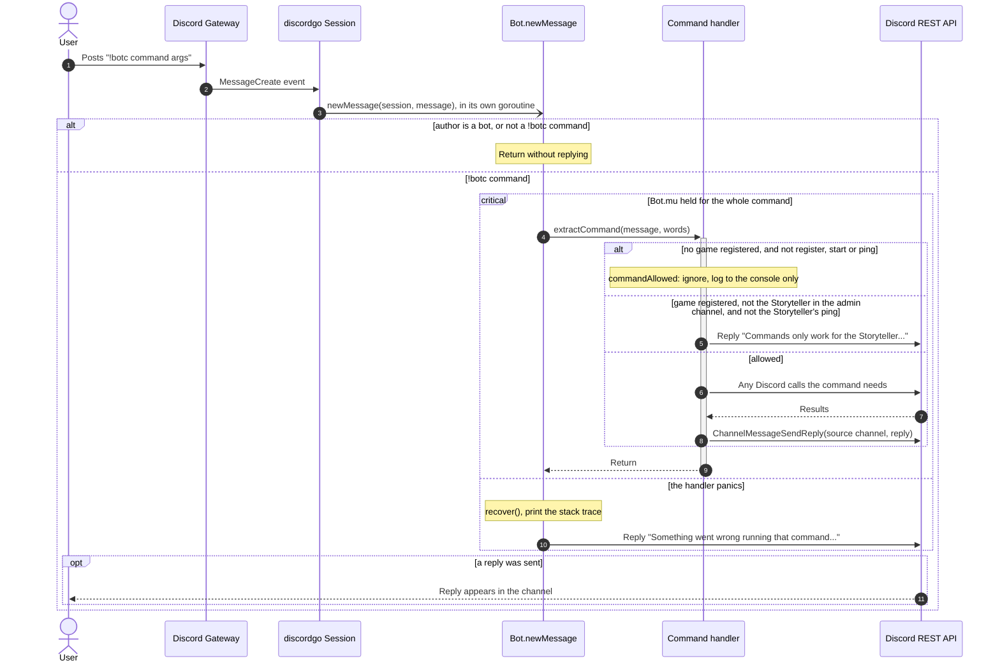

# Command dispatch

[← UML index](README.md)

How a Discord message becomes a command. Covers `newMessage`, `extractCommand` and `commandAllowed` in [internal/bot/commands.go](../../internal/bot/commands.go), and `newMessage` in [internal/bot/bot.go](../../internal/bot/bot.go).

## Activity: handling a message

discordgo calls `newMessage` in its own goroutine for every message the bot can see. `Bot.mu` lets only one command run at a time. The deferred `recover` means a bug in one command doesn't crash the bot and lose the game in memory. `commandAllowed` checks every command before it runs, so the command handlers make no access checks of their own.

```mermaid
flowchart TD
    start((" ")):::initial --> recv("Receive MessageCreate")
    recv --> d1{" "}
    d1 -->|"[author missing, or a bot]"| ignored(((" "))):::final
    d1 -->|"[human author]"| split("Split the content into words<br/>(strings.Fields)")
    split --> d2{" "}
    d2 -->|"[fewer than 2 words, or the first isn't !botc]"| ignored
    d2 -->|"[!botc command]"| lock("Lock Bot.mu<br/>Defer recover")
    lock --> allowed("extractCommand: lower-case the 2nd word,<br/>then commandAllowed")
    allowed --> dok{" "}
    dok -->|"[not allowed]"| notrun("Don't run the command<br/>(commandAllowed has ignored or refused it)")
    dok -->|"[allowed]"| cmd{"Which command?"}
    cmd -->|"[ping]"| ping("Send pong")
    cmd -->|"[register, start]"| reg("register")
    cmd -->|"[unregister, end]"| unreg("unregister")
    cmd -->|"[sitrep]"| sit("sitrep")
    cmd -->|"[map]"| maprooms("mapRooms<br/>(reply with the error if it fails)")
    cmd -->|"[village]"| vil("village")
    cmd -->|"[character]"| chr("character")
    cmd -->|"[grimoire]"| gri("characterList")
    cmd -->|"[whisper]"| whi("whisper")
    cmd -->|"[anything else]"| wtf("Reply: Huh? WTF is that command?!")
    notrun & ping & reg & unreg & sit & maprooms & vil & chr & gri & whi & wtf --> merged{" "}
    merged -->|"[the command panicked]"| rec("Log the stack trace<br/>Reply: Something went wrong")
    merged -->|"[no panic]"| unlock("Unlock Bot.mu")
    rec --> unlock
    unlock --> done(((" "))):::final

    classDef initial fill:#000,stroke:#666
    classDef final fill:#000,stroke:#666
```

Each command is detailed in [game-lifecycle.md](game-lifecycle.md), [village.md](village.md) and [characters.md](characters.md).

## Sequence: handling a message

## Activity: `commandAllowed`

Checked before every command. With no game registered, only `register` / `start` and `ping` may run, from any channel; `register`'s channel then becomes the admin channel. Once a game is registered, every command must come from the Storyteller, in the admin channel, except `ping`, which the Storyteller can send from anywhere.

```mermaid
flowchart TD
    start((" ")):::initial --> d1{" "}
    d1 -->|"[no game registered]"| d2{" "}
    d2 -->|"[register, start or ping]"| ok("Return true: run the command")
    d2 -->|"[any other command]"| r1("Log: Ignoring, no game registered<br/>(no reply)")
    d1 -->|"[game registered]"| dping{" "}
    dping -->|"[ping from the Storyteller]"| ok
    dping -->|"[anything else]"| d3{" "}
    d3 -->|"[another server, not the Storyteller,<br/>or not the admin channel]"| r2("Reply: Commands only work for the Storyteller,<br/>in the admin channel")
    d3 -->|"[Storyteller, in the admin channel]"| ok
    r1 --> refused(((" "))):::final
    r2 --> refused
    ok --> allowed(((" "))):::final

    classDef initial fill:#000,stroke:#666
    classDef final fill:#000,stroke:#666
```

---

Last checked against code: 2026-09-27 (7fc00d0)
