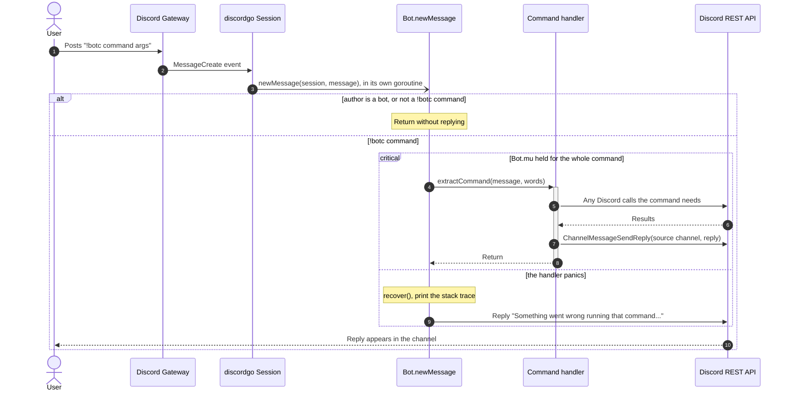

# Command dispatch

[← UML index](README.md)

How a Discord message becomes a command. Covers `newMessage`, `extractCommand` and `requireStorytellerInAdmin` in [internal/bot/bot.go](../../internal/bot/bot.go).

## Activity: handling a message

discordgo calls `newMessage` in its own goroutine for every message the bot can see. `Bot.mu` lets only one command run at a time. The deferred `recover` means a bug in one command doesn't crash the bot and lose the game in memory.

```mermaid
flowchart TD
    start((" ")):::initial --> recv("Receive MessageCreate")
    recv --> d1{" "}
    d1 -->|"[author missing, or a bot]"| ignored(((" "))):::final
    d1 -->|"[human author]"| split("Split the content into words<br/>(strings.Fields)")
    split --> d2{" "}
    d2 -->|"[fewer than 2 words, or the first isn't !botc]"| ignored
    d2 -->|"[!botc command]"| lock("Lock Bot.mu<br/>Defer recover")
    lock --> cmd{"extractCommand:<br/>2nd word, lower-cased"}
    cmd -->|"[ping]"| ping("Send pong")
    cmd -->|"[register, start]"| reg("register")
    cmd -->|"[unregister, end]"| unreg("unregister")
    cmd -->|"[sitrep]"| sit("sitrep")
    cmd -->|"[map]"| dmap{" "}
    dmap -->|"[game registered]"| maprooms("mapRooms")
    dmap -->|"[no game]"| nogame("Reply: No game registered")
    cmd -->|"[village]"| vil("village")
    cmd -->|"[character]"| chr("character")
    cmd -->|"[grimoire]"| gri("requireStorytellerInAdmin,<br/>then characterList")
    cmd -->|"[whisper]"| whi("whisper")
    cmd -->|"[pmove, cmove]"| stub("Do nothing (stubs)")
    cmd -->|"[anything else]"| wtf("Reply: Huh? WTF is that command?!")
    ping & reg & unreg & sit & maprooms & nogame & vil & chr & gri & whi & stub & wtf --> merged{" "}
    merged -->|"[the command panicked]"| rec("Log the stack trace<br/>Reply: Something went wrong")
    merged -->|"[no panic]"| unlock("Unlock Bot.mu")
    rec --> unlock
    unlock --> done(((" "))):::final

    classDef initial fill:#000,stroke:#666
    classDef final fill:#000,stroke:#666
```

Each command is detailed in [game-lifecycle.md](game-lifecycle.md), [village.md](village.md) and [characters.md](characters.md).

## Sequence: handling a message

## Activity: `requireStorytellerInAdmin`

This check guards `village`, `character`, `grimoire` and `whisper`. `unregister` makes a similar check itself, but it doesn't require the admin channel.

```mermaid
flowchart TD
    start((" ")):::initial --> d1{" "}
    d1 -->|"[no game registered]"| r1("Reply: No game registered,<br/>this command will not execute")
    d1 -->|"[game registered]"| d2{" "}
    d2 -->|"[another server, not the Storyteller,<br/>or not the admin channel]"| r2("Reply: Only the Storyteller can run this,<br/>from the admin channel")
    d2 -->|"[Storyteller, in the admin channel]"| ok("Return true: run the command")
    r1 --> refused(((" "))):::final
    r2 --> refused
    ok --> allowed(((" "))):::final

    classDef initial fill:#000,stroke:#666
    classDef final fill:#000,stroke:#666
```

---

Last checked against code: 2026-09-26 (aba771e)
