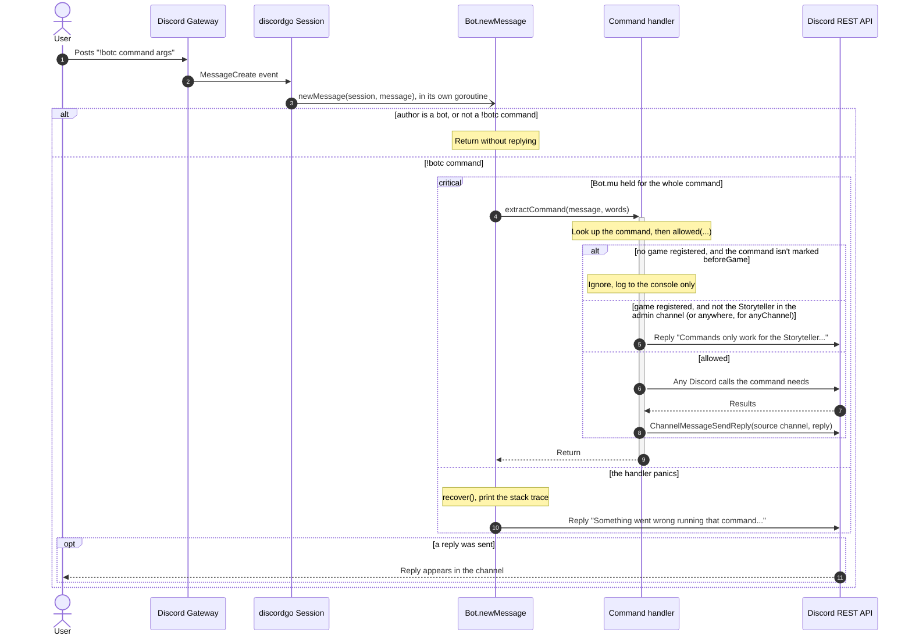

# Command dispatch

[← UML index](README.md)

How a Discord message becomes a command. Covers `newMessage` in [internal/bot/bot.go](../../internal/bot/bot.go), and `extractCommand`, the `commands` table and `allowed` in [internal/bot/commands.go](../../internal/bot/commands.go).

## Activity: handling a message

discordgo calls `newMessage` in its own goroutine for every message the bot can see. `Bot.mu` lets only one command run at a time. The deferred `recover` means a bug in one command doesn't crash the bot and lose the game in memory. Each command's entry in the `commands` table says who may run it and where, and `allowed` checks that before it runs, so the command handlers make no access checks of their own. Aliases, such as `start` for `register`, are extra entries pointing at the same handler.

```mermaid
flowchart TD
    start((" ")):::initial --> recv("Receive MessageCreate")
    recv --> d1{" "}
    d1 -->|"[author missing, or a bot]"| ignored(((" "))):::final
    d1 -->|"[human author]"| split("Split the content into words<br/>(strings.Fields)")
    split --> d2{" "}
    d2 -->|"[fewer than 2 words, or the first isn't !botc]"| ignored
    d2 -->|"[!botc command]"| lock("Lock Bot.mu<br/>Defer recover")
    lock --> lookup("extractCommand: look up the lower-cased 2nd word<br/>in the commands table (unknown: no flags)")
    lookup --> allowed("allowed(game, command, sender, server, channel)")
    allowed --> dok{" "}
    dok -->|"[not allowed, no refusal]"| ign("Log: Ignoring, no game registered")
    dok -->|"[not allowed, with a refusal]"| refuse("Reply with the refusal")
    dok -->|"[allowed]"| cmd{"Which command?"}
    cmd -->|"[ping]"| ping("Send pong")
    cmd -->|"[register, start]"| reg("register")
    cmd -->|"[unregister, end]"| unreg("unregister")
    cmd -->|"[sitrep]"| sit("sitrep")
    cmd -->|"[map]"| maprooms("mapCommand: mapRooms<br/>(reply with the error if it fails)")
    cmd -->|"[village]"| vil("village")
    cmd -->|"[character]"| chr("character")
    cmd -->|"[grimoire]"| gri("characterList")
    cmd -->|"[whisper]"| whi("whisper")
    cmd -->|"[anything else]"| wtf("Reply: Huh? WTF is that command?!")
    ign & refuse & ping & reg & unreg & sit & maprooms & vil & chr & gri & whi & wtf --> merged{" "}
    merged -->|"[the command panicked]"| rec("Log the stack trace<br/>Reply: Something went wrong")
    merged -->|"[no panic]"| unlock("Unlock Bot.mu")
    rec --> unlock
    unlock --> done(((" "))):::final

    classDef initial fill:#000,stroke:#666
    classDef final fill:#000,stroke:#666
```

Each command is detailed in [game-lifecycle.md](game-lifecycle.md), [village.md](village.md) and [characters.md](characters.md).

## Sequence: handling a message

## Activity: `allowed`

A pure function: it makes no Discord calls, so `commands_test.go` covers every case. It uses two flags from the command's table entry:

- `beforeGame` (`register`, `start`, `ping`): anyone may run it, from any channel, while no game is registered.
- `anyChannel` (`ping`): the Storyteller may run it outside the admin channel.

`extractCommand` logs an ignored command and replies with a refusal.

```mermaid
flowchart TD
    start((" ")):::initial --> d1{" "}
    d1 -->|"[no game registered]"| d2{" "}
    d2 -->|"[beforeGame]"| ok("Return true")
    d2 -->|"[not beforeGame]"| r1("Return false, no refusal<br/>(ignore)")
    d1 -->|"[game registered]"| d3{" "}
    d3 -->|"[Storyteller, and in the admin channel<br/>of the registered server, or anyChannel]"| ok
    d3 -->|"[anyone else, or anywhere else]"| r2("Return false, refusal:<br/>Commands only work for the Storyteller,<br/>in the admin channel")
    r1 --> refused(((" "))):::final
    r2 --> refused
    ok --> allowedEnd(((" "))):::final

    classDef initial fill:#000,stroke:#666
    classDef final fill:#000,stroke:#666
```

---

Last checked against code: 2026-09-27 (4bef1c8)
