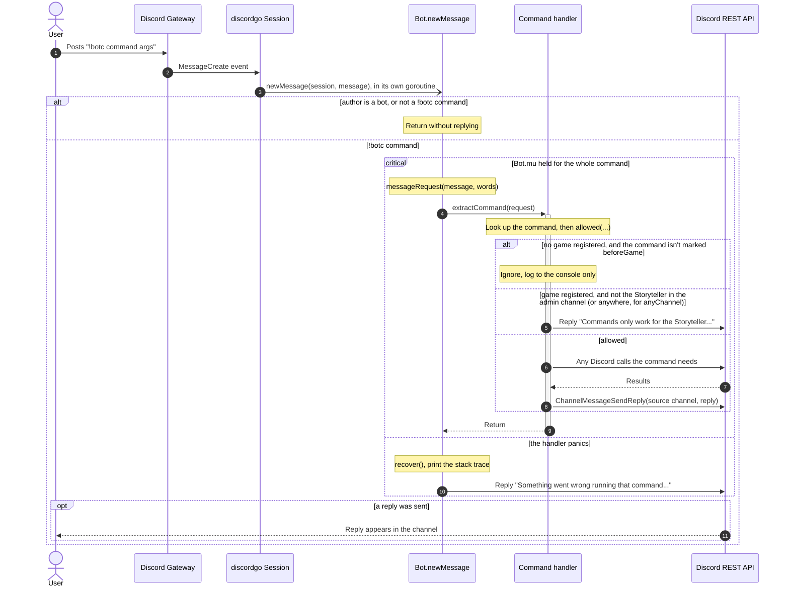
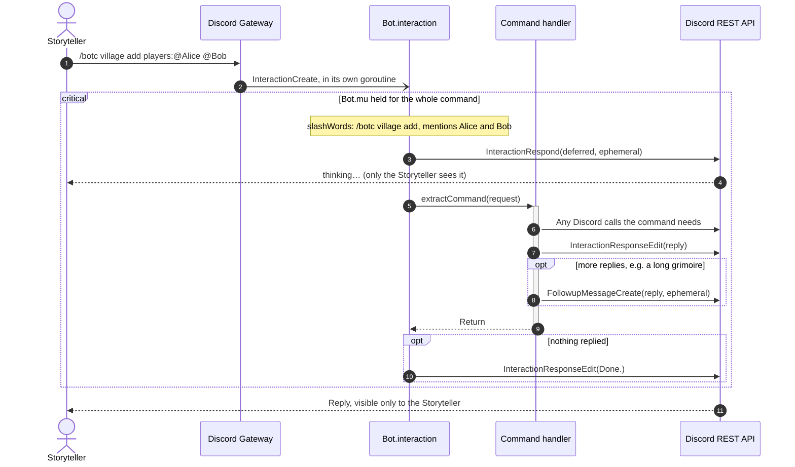
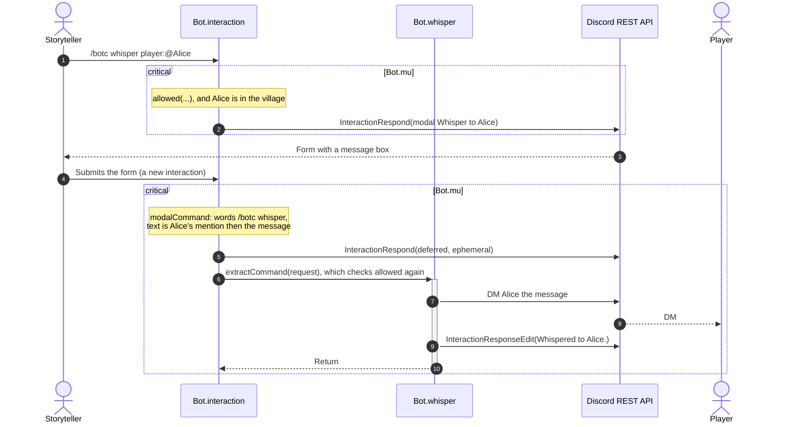

# Command dispatch

[← UML index](README.md)

How a `!botc` message or a `/botc` slash command becomes a command. Covers `newMessage` and `messageRequest` in [internal/bot/bot.go](../../internal/bot/bot.go); `extractCommand`, `dispatch`, the `commands` table and `allowed` in [internal/bot/commands.go](../../internal/bot/commands.go); and `interaction`, `slashCommand`, `modalSubmit`, `runSlash` and `slashResponder` in [internal/bot/interactions.go](../../internal/bot/interactions.go), with `slashWords` and `modalCommand` in [internal/bot/slash.go](../../internal/bot/slash.go).

Both forms build a `request` (the sender, server, channel, command words, raw text, mentioned users, and how to reply) and run the same handler through `extractCommand`, so handlers never know which form a command came from.

## Activity: handling a message

discordgo calls `newMessage` in its own goroutine for every message the bot can see. `Bot.mu` lets only one command run at a time. The deferred `recover` means a bug in one command doesn't crash the bot and lose the game in memory. Each command's entry in the `commands` table says who may run it and where, and `allowed` checks that before it runs, so the command handlers make no access checks of their own. Aliases, such as `start` for `register`, are extra entries pointing at the same handler.

```mermaid
flowchart TD
    start((" ")):::initial --> recv("Receive MessageCreate")
    recv --> d1{" "}
    d1 -->|"[author missing, or a bot]"| ignored(((" "))):::final
    d1 -->|"[human author]"| split("Split the content into words<br/>(strings.Fields)")
    split --> d2{" "}
    d2 -->|"[fewer than 2 words, or the first isn't !botc]"| ignored
    d2 -->|"[!botc command]"| lock("Lock Bot.mu<br/>Defer recover")
    lock --> build("messageRequest: build a request<br/>(replies threaded to the message)")
    build --> lookup("extractCommand: look up the lower-cased 2nd word<br/>in the commands table (unknown: no flags)")
    lookup --> allowed("allowed(game, command, sender, server, channel)")
    allowed --> dok{" "}
    dok -->|"[not allowed, no refusal]"| ign("Log: Ignoring, no game registered")
    dok -->|"[not allowed, with a refusal]"| refuse("Reply with the refusal")
    dok -->|"[allowed]"| cmd{"Which command?"}
    cmd -->|"[ping]"| ping("Send pong")
    cmd -->|"[register, start]"| reg("register")
    cmd -->|"[unregister, end]"| unreg("unregister")
    cmd -->|"[sitrep]"| sit("sitrep")
    cmd -->|"[map]"| maprooms("mapCommand: mapRooms<br/>(reply with the error if it fails)")
    cmd -->|"[village]"| vil("village")
    cmd -->|"[character]"| chr("character")
    cmd -->|"[grimoire]"| gri("characterList")
    cmd -->|"[whisper]"| whi("whisper")
    cmd -->|"[gather]"| gat("gather")
    cmd -->|"[anything else]"| wtf("Reply: Huh? WTF is that command?!")
    ign & refuse & ping & reg & unreg & sit & maprooms & vil & chr & gri & whi & gat & wtf --> merged{" "}
    merged -->|"[the command panicked]"| rec("Log the stack trace<br/>Reply: Something went wrong")
    merged -->|"[no panic]"| unlock("Unlock Bot.mu")
    rec --> unlock
    unlock --> done(((" "))):::final

    classDef initial fill:#000,stroke:#666
    classDef final fill:#000,stroke:#666
```

Each command is detailed in [game-lifecycle.md](game-lifecycle.md), [village.md](village.md), [characters.md](characters.md) and [gather.md](gather.md).

## Sequence: handling a message

## Activity: handling a slash command

discordgo calls `interaction` for every interaction. Discord needs an answer within 3 seconds and every answer is ephemeral, which `slashResponder` handles: `acknowledge` shows "thinking…", and each `reply` fills it in or adds a follow-up. `whisper` and `character assign` answer with a form instead, which must be the first response, so they check `allowed` themselves before opening it. The submitted form comes back as a second interaction (see the form sequence below).

```mermaid
flowchart TD
    start((" ")):::initial --> d1{" "}
    d1 -->|"[not in a server, not /botc, or not one of the bot's forms]"| ignored(((" "))):::final
    d1 -->|"[/botc command or bot form]"| lock("Lock Bot.mu<br/>Defer recover")
    lock --> kind{" "}
    kind -->|"[slash command]"| words("slashWords: options to words<br/>and mentioned user IDs")
    words --> form{" "}
    form -->|"[whisper or character assign]"| fok{" "}
    fok -->|"[not allowed]"| frefuse("Reply: the refusal,<br/>or No game registered")
    fok -->|"[player not in the village]"| fnot("Reply: isn't in the village")
    fok -->|"[allowed]"| open("Open the form<br/>(whisperModal or assignModal)")
    form -->|"[any other command]"| ack("acknowledge: thinking…")
    kind -->|"[form submitted]"| mc("modalCommand: form to words<br/>and raw text for parse.go")
    mc --> ack
    ack --> resolve("resolveUsers: mentioned IDs to users")
    resolve --> ext("extractCommand(request):<br/>allowed, then the handler")
    ext --> d3{" "}
    d3 -->|"[ignored: no game registered]"| nogame("Reply: No game registered")
    d3 -->|"[ran or refused]"| d4{" "}
    nogame --> d4
    d4 -->|"[nothing replied]"| doneReply("Reply: Done.")
    d4 -->|"[replied]"| merged{" "}
    doneReply --> merged
    frefuse & fnot & open --> merged
    merged -->|"[panicked]"| rec("Log the stack trace<br/>Reply: Something went wrong")
    merged -->|"[no panic]"| unlock("Unlock Bot.mu")
    rec --> unlock
    unlock --> done(((" "))):::final

    classDef initial fill:#000,stroke:#666
    classDef final fill:#000,stroke:#666
```

## Sequence: handling a slash command

## Sequence: a command with a form

## Activity: `allowed`

A pure function: it makes no Discord calls, so `commands_test.go` covers every case. It uses two flags from the command's table entry:

- `beforeGame` (`register`, `start`, `ping`): anyone may run it, from any channel, while no game is registered.
- `anyChannel` (`ping`): the Storyteller may run it outside the admin channel.

`extractCommand` logs an ignored command and replies with a refusal. For a slash command, an ignored command gets a "No game registered" reply instead, because Discord needs every slash command answered.

```mermaid
flowchart TD
    start((" ")):::initial --> d1{" "}
    d1 -->|"[no game registered]"| d2{" "}
    d2 -->|"[beforeGame]"| ok("Return true")
    d2 -->|"[not beforeGame]"| r1("Return false, no refusal<br/>(ignore)")
    d1 -->|"[game registered]"| d3{" "}
    d3 -->|"[Storyteller, and in the admin channel<br/>of the registered server, or anyChannel]"| ok
    d3 -->|"[anyone else, or anywhere else]"| r2("Return false, refusal:<br/>Commands only work for the Storyteller,<br/>in the admin channel")
    r1 --> refused(((" "))):::final
    r2 --> refused
    ok --> allowedEnd(((" "))):::final

    classDef initial fill:#000,stroke:#666
    classDef final fill:#000,stroke:#666
```

---

Last checked against code: 2026-09-27 (b1fa7f3)
