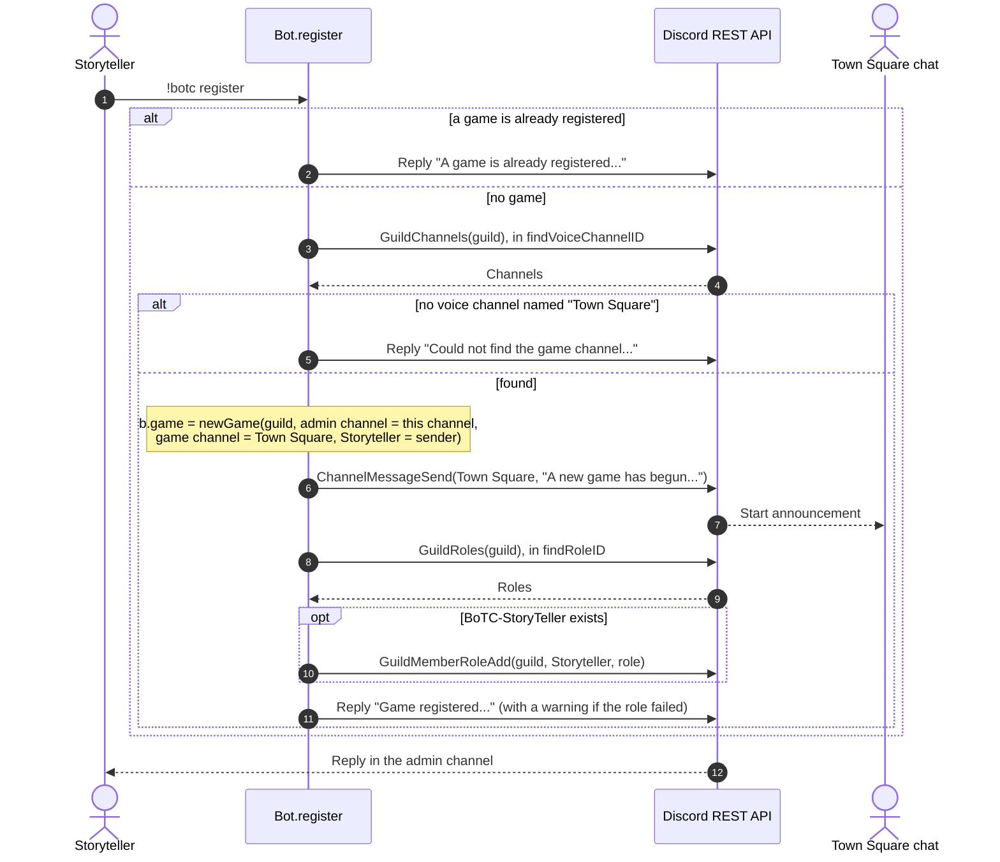
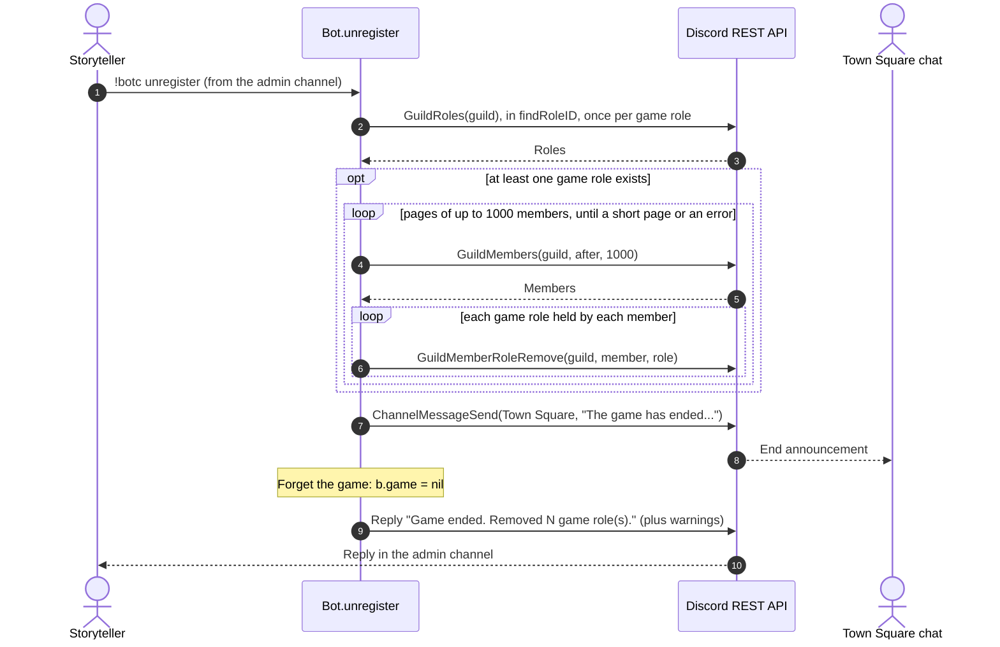
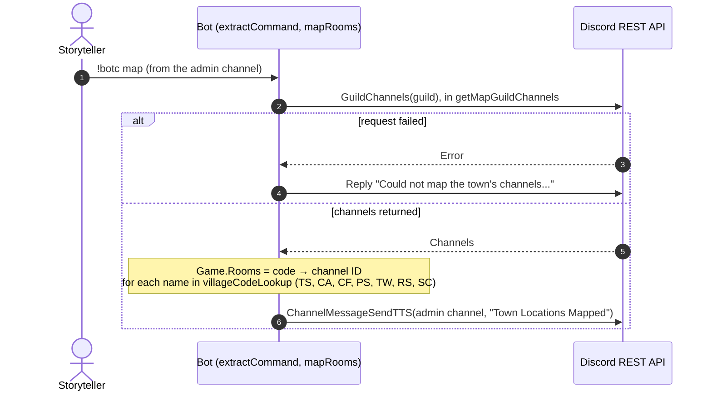
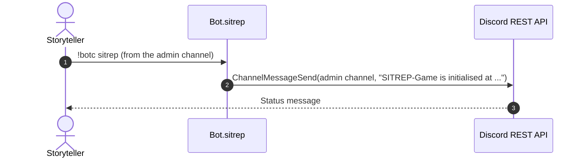

# Game lifecycle: register, map, sitrep, unregister

[← UML index](README.md)

Starting and ending a game, and the commands that report on it or prepare it. Covers `register`, `unregister`, `removeGameRoles`, `mapRooms`, `sitrep` and their helpers in [internal/bot/game.go](../../internal/bot/game.go) and [internal/bot/roles.go](../../internal/bot/roles.go). The bot runs one game at a time.

Every command here has already passed [`commandAllowed`](command-dispatch.md#activity-commandallowed): `register` runs from anywhere when no game is registered, and everything else, including `register` once a game exists, only runs for the Storyteller in the admin channel.

## Activity: `register`

Whoever sends `!botc register` (or `start`) becomes the Storyteller, and the channel they send it from becomes the admin channel. If the Storyteller role can't be given, registration still succeeds and the reply includes a warning. The "already registered" refusal is only reached by the Storyteller in the admin channel; `commandAllowed` refuses anyone else.

```mermaid
flowchart TD
    start((" ")):::initial --> d1{" "}
    d1 -->|"[a game is already registered]"| refused1("Reply: A game is already registered")
    d1 -->|"[no game]"| find("findVoiceChannelID:<br/>look for a voice channel named Town Square")
    find --> d2{" "}
    d2 -->|"[no such channel, or GuildChannels failed]"| refused2("Reply: Could not find the game channel")
    d2 -->|"[found]"| save("Save the guild, admin channel = this channel,<br/>game channel = Town Square, Storyteller = sender<br/>(newGame, with empty player, character and room lists)")
    save --> announce("Post in Town Square: A new game has begun")
    announce --> role("assignStorytellerRole:<br/>findRoleID(BoTC-StoryTeller), then give it to the sender")
    role --> d3{" "}
    d3 -->|"[role missing, above the bot, or the request failed]"| warn("Add a role warning to the reply")
    d3 -->|"[role given]"| reply("Reply: Game registered")
    warn --> reply
    refused1 --> refused(((" "))):::final
    refused2 --> refused
    reply --> registered(((" "))):::final

    classDef initial fill:#000,stroke:#666
    classDef final fill:#000,stroke:#666
```

## Sequence: `register`

## Activity: `unregister`

`commandAllowed` has already checked that a game is registered and that the Storyteller sent this from the admin channel. `removeGameRoles` takes both game roles from **every** member who has them, including roles given out by hand, and carries on past individual failures.

```mermaid
flowchart TD
    start((" ")):::initial --> look("findRoleID for BoTC-StoryTeller and BoTC-Player<br/>(record an error for any role that's missing)")
    look --> d3{" "}
    d3 -->|"[neither role found]"| announce
    d3 -->|"[at least one found]"| page("GuildMembers: fetch the next page<br/>of up to 1000 members")
    page --> d4{" "}
    d4 -->|"[request failed]"| recErr("Record the error")
    d4 -->|"[page fetched]"| strip("For each game role a member has:<br/>GuildMemberRoleRemove, then count it,<br/>or record the error")
    strip --> d5{" "}
    d5 -->|"[full page: more members may follow]"| page
    d5 -->|"[last page]"| announce("Post in Town Square:<br/>The game has ended")
    recErr --> announce
    announce --> reset("Forget the game: b.game = nil")
    reset --> reply("Reply: Game ended, N roles removed<br/>(plus a warning listing any errors)")
    reply --> ended(((" "))):::final

    classDef initial fill:#000,stroke:#666
    classDef final fill:#000,stroke:#666
```

## Sequence: `unregister`

## Sequence: `map`

`map` finds the village's voice channels by name (see `villageCodeLookup`) and stores their IDs in `Game.Rooms`. It doesn't move anyone.

## Sequence: `sitrep`

`sitrep` only runs while a game is registered: `commandAllowed` ignores it otherwise.

---

Last checked against code: 2026-09-27 (6d82bd7)
