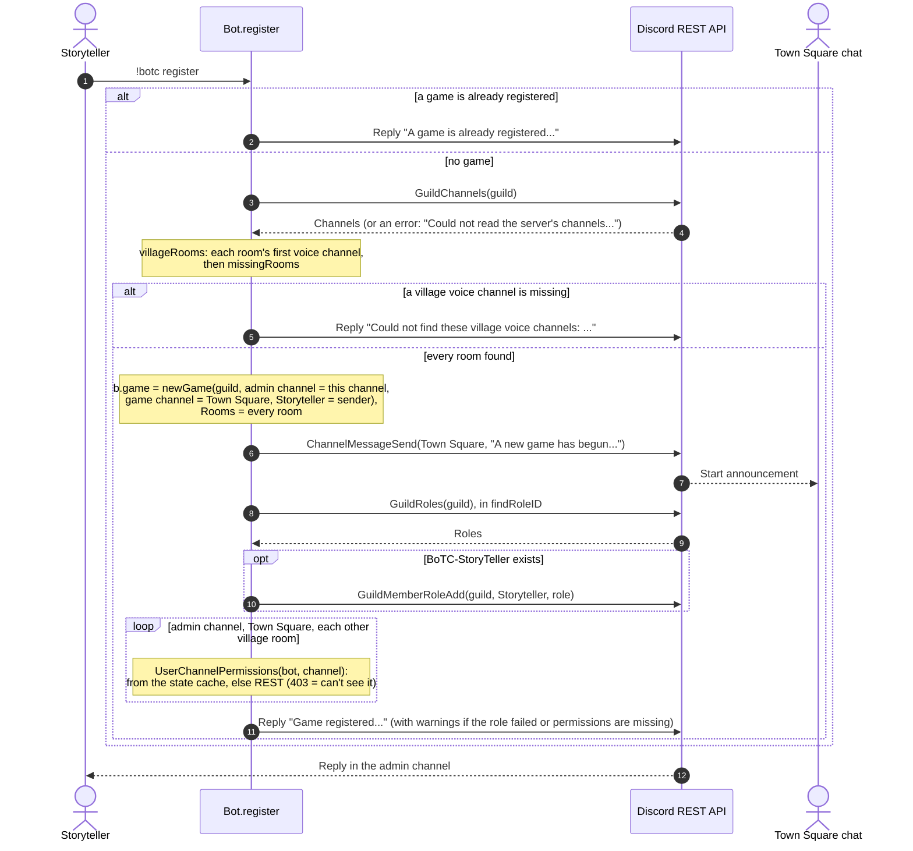
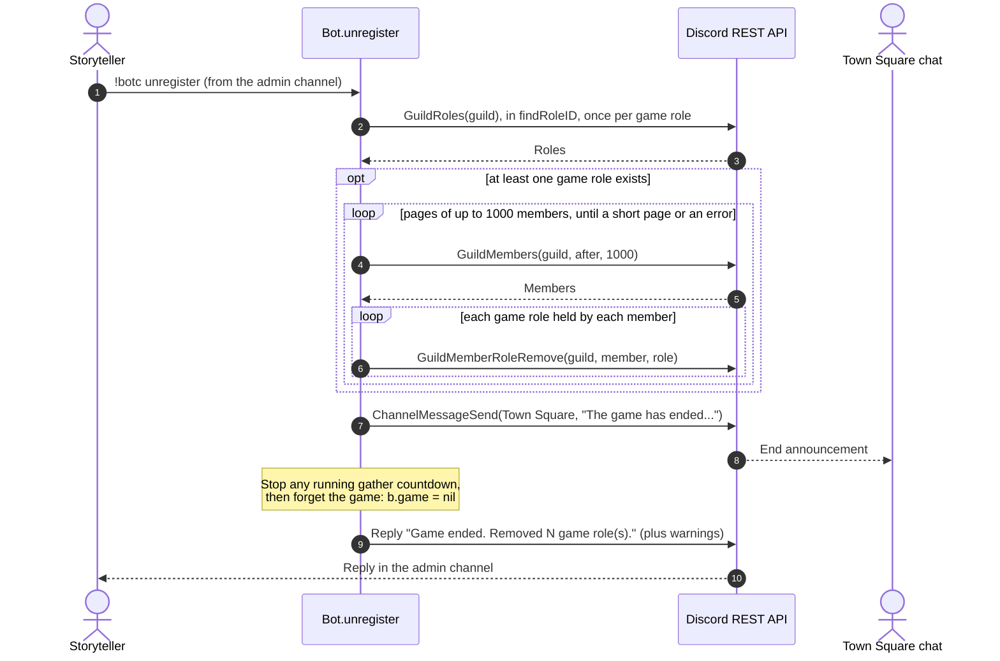
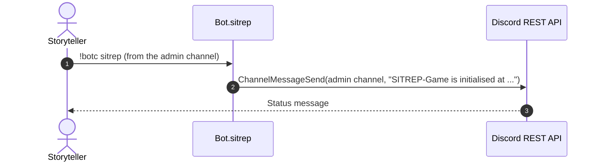

# Game lifecycle: register, sitrep, unregister

[← UML index](README.md)

Starting and ending a game, and reporting on it. Covers `register`, `unregister`, `sitrep` and their helpers in [internal/bot/lifecycle.go](../../internal/bot/lifecycle.go), `newGame`, `villageRooms` and `missingRooms` in [internal/bot/game.go](../../internal/bot/game.go), and `removeGameRoles` in [internal/bot/roles.go](../../internal/bot/roles.go). The bot runs one game at a time.

Every command here has already passed [`allowed`](command-dispatch.md#activity-allowed): `register` runs from anywhere when no game is registered, and everything else, including `register` once a game exists, only runs for the Storyteller in the admin channel.

## Activity: `register`

Whoever sends `!botc register` (or `start`) becomes the Storyteller, and the channel they send it from becomes the admin channel. Every village voice channel in `villageCodeLookup` must exist, or nothing is registered. If the Storyteller role can't be given, or the bot is missing channel permissions, registration still succeeds and the reply includes a warning. The "already registered" refusal is only reached by the Storyteller in the admin channel; `allowed` refuses anyone else.

```mermaid
flowchart TD
    start((" ")):::initial --> d1{" "}
    d1 -->|"[a game is already registered]"| refused1("Reply: A game is already registered")
    d1 -->|"[no game]"| list("GuildChannels: the server's channels")
    list --> d0{" "}
    d0 -->|"[request failed]"| refused0("Reply: Could not read the server's channels")
    d0 -->|"[channels returned]"| find("villageRooms: code → the first voice channel<br/>with each name in villageCodeLookup")
    find --> d2{" "}
    d2 -->|"[missingRooms: any room not found]"| refused2("Reply: Could not find these village<br/>voice channels, naming them")
    d2 -->|"[every room found]"| save("newGame: the guild, admin channel = this channel,<br/>game channel = Town Square, Storyteller = sender,<br/>Rooms = every room; no players yet")
    save --> announce("Post in Town Square: A new game has begun")
    announce --> role("assignStorytellerRole:<br/>findRoleID(BoTC-StoryTeller), then give it to the sender")
    role --> d3{" "}
    d3 -->|"[role missing, above the bot, or the request failed]"| warn("Add a role warning to the reply")
    d3 -->|"[role given]"| perms("channelAccessWarning: the bot's permissions in the<br/>admin channel and every village room (villageChannels)")
    warn --> perms
    perms --> d4{" "}
    d4 -->|"[a permission missing, or a channel it can't see]"| pwarn("Add a warning listing each channel's<br/>missing permissions")
    d4 -->|"[all present]"| reply("Reply: Game registered")
    pwarn --> reply
    refused1 --> refused(((" "))):::final
    refused0 --> refused
    refused2 --> refused
    reply --> registered(((" "))):::final

    classDef initial fill:#000,stroke:#666
    classDef final fill:#000,stroke:#666
```

## Sequence: `register`

## Activity: `unregister`

`allowed` has already checked that a game is registered and that the Storyteller sent this from the admin channel. `removeGameRoles` takes both game roles from **every** member who has them, including roles given out by hand, and carries on past individual failures.

```mermaid
flowchart TD
    start((" ")):::initial --> look("findRoleID for BoTC-StoryTeller and BoTC-Player<br/>(record an error for any role that's missing)")
    look --> d3{" "}
    d3 -->|"[neither role found]"| announce
    d3 -->|"[at least one found]"| page("GuildMembers: fetch the next page<br/>of up to 1000 members")
    page --> d4{" "}
    d4 -->|"[request failed]"| recErr("Record the error")
    d4 -->|"[page fetched]"| strip("For each game role a member has:<br/>GuildMemberRoleRemove, then count it,<br/>or record the error")
    strip --> d5{" "}
    d5 -->|"[full page: more members may follow]"| page
    d5 -->|"[last page]"| announce("Post in Town Square:<br/>The game has ended")
    recErr --> announce
    announce --> stopg("Stop any running gather countdown<br/>(gatherCountdown.stop)")
    stopg --> reset("Forget the game: b.game = nil")
    reset --> reply("Reply: Game ended, N roles removed<br/>(plus a warning listing any errors)")
    reply --> ended(((" "))):::final

    classDef initial fill:#000,stroke:#666
    classDef final fill:#000,stroke:#666
```

## Sequence: `unregister`

## Sequence: `sitrep`

`sitrep` only runs while a game is registered: `allowed` ignores it otherwise.

---

Last checked against code: 2026-09-27 (10f6993)
