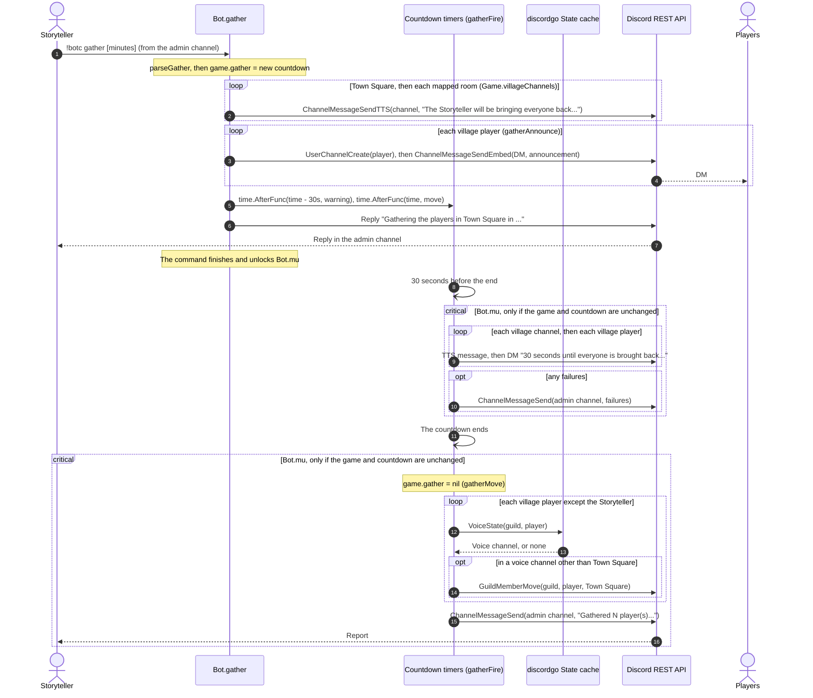
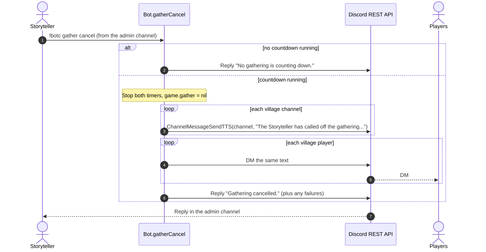

# Gather: bringing the players back to Town Square

[← UML index](README.md)

`!botc gather` starts a countdown, announces it, warns again 30 seconds before the end, then moves the players into Town Square. Covers `gather`, `parseGather`, `gatherCancel`, `gatherFire`, `gatherWarn`, `gatherMove` and `gatherAnnounce` in [internal/bot/gather.go](../../internal/bot/gather.go), and `Game.villageChannels` in [internal/bot/game.go](../../internal/bot/game.go).

The command has already passed [`allowed`](command-dispatch.md#activity-allowed), so a game is registered and the Storyteller sent it from the admin channel. The warning and the move run later, from `time.AfterFunc` timers in their own goroutines. `gatherFire` runs each one through `locked`, so it takes `Bot.mu` like a command, and does nothing if the game was unregistered or replaced, or the countdown cancelled, in the meantime.

## Activity: `gather`

```mermaid
flowchart TD
    start((" ")):::initial --> parse("parseGather: the words after gather")
    parse --> d1{" "}
    d1 -->|"[not blank, cancel or 1 to 10]"| usage("Reply: Could not read that, with the usage")
    d1 -->|"[cancel]"| d2{" "}
    d2 -->|"[no countdown running]"| none("Reply: No gathering is counting down")
    d2 -->|"[countdown running]"| stop("Stop both timers<br/>game.gather = nil")
    stop --> callOff("gatherAnnounce: The Storyteller has called off the gathering")
    callOff --> cancelled("Reply: Gathering cancelled (plus any failures)")
    d1 -->|"[blank: 60 seconds, or N minutes]"| d3{" "}
    d3 -->|"[a countdown is already running]"| busy("Reply: A gathering is already counting down,<br/>with the time left")
    d3 -->|"[none running]"| create("game.gather = new countdown ending at now + time")
    create --> first("gatherAnnounce: The Storyteller will be bringing<br/>everyone back to Town Square in ...")
    first --> timers("time.AfterFunc(time - 30s, warning)<br/>time.AfterFunc(time, move)")
    timers --> started("Reply: Gathering the players in Town Square in ...<br/>(plus a hint to run map if no rooms are mapped, and any failures)")
    usage & none & cancelled & busy --> finished(((" "))):::final
    started --> counting(((" "))):::final

    classDef initial fill:#000,stroke:#666
    classDef final fill:#000,stroke:#666
```

## Activity: `gatherMove`

Runs when the countdown ends, through `gatherFire`, which has already checked the countdown is still the registered game's.

```mermaid
flowchart TD
    start((" ")):::initial --> clear("game.gather = nil")
    clear --> next{" "}
    next -->|"[next village player, by name]"| st{" "}
    st -->|"[the Storyteller]"| next
    st -->|"[a player]"| vs("State.VoiceState(guild, player)")
    vs --> d1{" "}
    d1 -->|"[not in voice]"| nv("Add to Not in voice")
    d1 -->|"[already in Town Square]"| next
    d1 -->|"[in another voice channel]"| move("GuildMemberMove(guild, player, Town Square)")
    move --> d2{" "}
    d2 -->|"[failed]"| fail("Add to Could not move, with the error")
    d2 -->|"[moved]"| count("Count it")
    nv & fail & count --> next
    next -->|"[no players left]"| report("Post in the admin channel: Gathered N player(s),<br/>then Not in voice and Could not move, if any")
    report --> done(((" "))):::final

    classDef initial fill:#000,stroke:#666
    classDef final fill:#000,stroke:#666
```

## Sequence: `gather` countdown

## Sequence: `gather cancel`

`unregister` also stops a running countdown (see [game-lifecycle.md](game-lifecycle.md)), without announcing it.

---

Last checked against code: 2026-09-27 (85bccfb)
