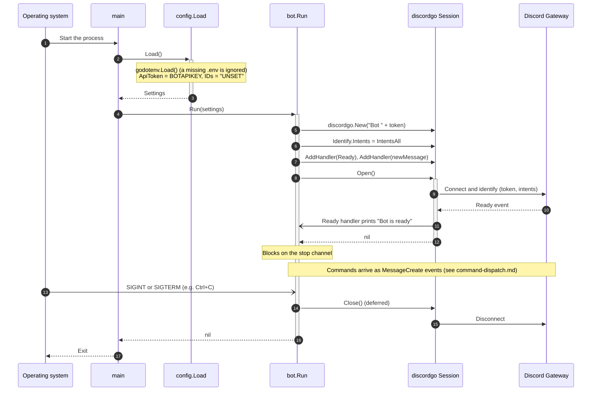

# Startup and shutdown

[← UML index](README.md)

How the bot starts, connects to Discord, and stops. Covers `main` in [cmd/bot/main.go](../../cmd/bot/main.go), `config.Load` in [internal/config/config.go](../../internal/config/config.go), and `bot.Run` in [internal/bot/bot.go](../../internal/bot/bot.go).

## Activity: startup and shutdown

A missing `.env` file is fine, because the token can come straight from the environment (as in the container). Any other error ends the process through `log.Fatal`.

```mermaid
flowchart TD
    start((" ")):::initial --> load("config.Load: godotenv.Load")
    load --> d1{" "}
    d1 -->|"[error other than file not found]"| fatal("log.Fatal: print the error and exit")
    d1 -->|"[.env loaded, or no .env file]"| fill("Read BOTAPIKEY<br/>Set guild, channel and Storyteller IDs to UNSET")
    fill --> run("bot.Run(settings)")
    run --> newS("discordgo.New with the bot token")
    newS --> d2{" "}
    d2 -->|"[error]"| fatal
    d2 -->|"[session created]"| intents("Request all gateway intents")
    intents --> handlers("Register handlers:<br/>Ready and newMessage")
    handlers --> open("Open the gateway connection")
    open --> d3{" "}
    d3 -->|"[error, e.g. bad token or intents not enabled]"| fatal
    d3 -->|"[connected]"| wait("Handle commands until SIGINT or SIGTERM<br/>(see command-dispatch.md)")
    wait --> closeS("Close the session (deferred)")
    closeS --> stopOk(((" "))):::final
    fatal --> stopErr(((" "))):::final

    classDef initial fill:#000,stroke:#666
    classDef final fill:#000,stroke:#666
```

## Sequence: startup and shutdown

---

Last checked against code: 2026-09-26 (aba771e)
