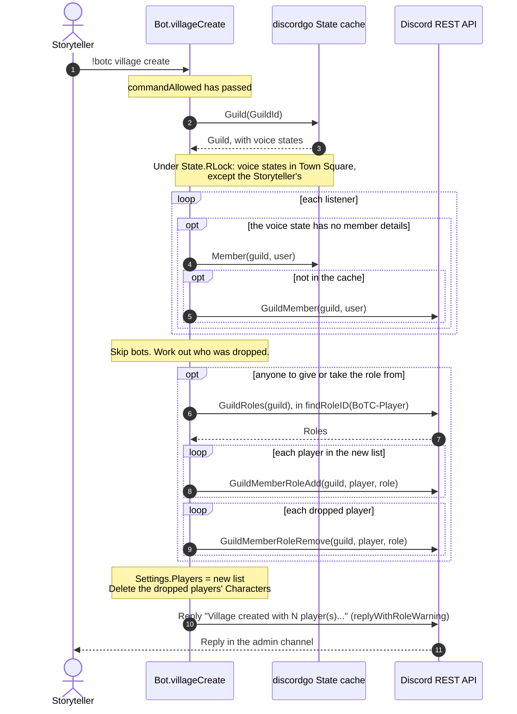

# Village management

[← UML index](README.md)

The village is the list of players in the game (`Settings.Players`, user ID → display name). Players in the village have the `BoTC-Player` role. Covers `village`, `villageCreate`, `villageAdd`, `villageRemove`, `setPlayerRole` and `lookupMember` in [internal/bot/bot.go](../../internal/bot/bot.go). Spec: [village-management.md](../specs/village-management.md).

## Activity: `village` dispatch

Like every command, `village` only runs for the Storyteller in the admin channel; [`commandAllowed`](command-dispatch.md#activity-commandallowed) checks that before `village` is called.

```mermaid
flowchart TD
    start((" ")):::initial --> d2{" "}
    d2 -->|"[no subcommand, or not one below]"| usage("Reply with the village usage")
    d2 -->|"[create]"| create("villageCreate")
    d2 -->|"[add]"| add("villageAdd")
    d2 -->|"[remove]"| remove("villageRemove")
    d2 -->|"[list]"| list("villageList: reply with the<br/>players, numbered and sorted")
    usage & create & add & remove & list --> done(((" "))):::final

    classDef initial fill:#000,stroke:#666
    classDef final fill:#000,stroke:#666
```

## Activity: `village create`

Replaces the village with everyone in Town Square voice, except the Storyteller and bots. The role is given to **everyone** in the new list, not just newcomers, so an earlier failure gets fixed. Anyone dropped from the village loses their role and their stored character.

```mermaid
flowchart TD
    start((" ")):::initial --> guild("Get the guild from the state cache")
    guild --> d1{" "}
    d1 -->|"[not in the cache]"| fail("Reply: Could not read who is in Town Square")
    d1 -->|"[found]"| scan("While holding the state read lock:<br/>collect the voice states in Town Square,<br/>except the Storyteller's")
    scan --> next{" "}
    next -->|"[another listener]"| lookup("lookupMember: the voice state's member,<br/>else the state cache, else GuildMember")
    lookup --> dbot{" "}
    dbot -->|"[bot]"| next
    dbot -->|"[person, or couldn't be looked up]"| keep("Add to the new list, with their display name<br/>(or user ID if not found)")
    keep --> next
    next -->|"[all checked]"| dropped("Dropped = old players not in the new list")
    dropped --> role("setPlayerRole: give BoTC-Player to the new list,<br/>take it from the dropped players")
    role --> replace("Players = the new list<br/>Delete the dropped players' characters")
    replace --> reply("Reply: Village created with N player(s)<br/>(or: it is empty), who was dropped,<br/>and a warning if the role couldn't be fully updated")
    fail --> done(((" "))):::final
    reply --> done

    classDef initial fill:#000,stroke:#666
    classDef final fill:#000,stroke:#666
```

## Sequence: `village create`

## Activity: `village add`

```mermaid
flowchart TD
    start((" ")):::initial --> d0{" "}
    d0 -->|"[no mentions]"| usage("Reply: Mention the players to add")
    d0 -->|"[one or more mentions]"| next{" "}
    next -->|"[next mention: a bot]"| skip("Record as skipped, with the reason")
    next -->|"[next mention: the Storyteller]"| skip
    next -->|"[next mention: already in the village]"| skip
    next -->|"[next mention: anyone else]"| mark("Look up their display name<br/>Mark them to add")
    skip --> next
    mark --> next
    next -->|"[no more mentions]"| role("setPlayerRole: give BoTC-Player<br/>to the players being added")
    role --> store("Add them to Settings.Players")
    store --> reply("Reply: Added N player(s), who was skipped,<br/>and any role warning")
    usage --> done(((" "))):::final
    reply --> done

    classDef initial fill:#000,stroke:#666
    classDef final fill:#000,stroke:#666
```

## Activity: `village remove`

```mermaid
flowchart TD
    start((" ")):::initial --> d0{" "}
    d0 -->|"[no mentions]"| usage("Reply: Mention the players to remove")
    d0 -->|"[one or more mentions]"| next{" "}
    next -->|"[next mention: not in the village]"| skip("Record as skipped")
    next -->|"[next mention: in the village]"| mark("Mark them to remove")
    skip --> next
    mark --> next
    next -->|"[no more mentions]"| role("setPlayerRole: take BoTC-Player<br/>from the players being removed")
    role --> del("Delete them from Settings.Players<br/>and delete their characters")
    del --> reply("Reply: Removed N player(s), who was skipped,<br/>and any role warning")
    usage --> done(((" "))):::final
    reply --> done

    classDef initial fill:#000,stroke:#666
    classDef final fill:#000,stroke:#666
```

---

Last checked against code: 2026-09-26 (f517dc2)
